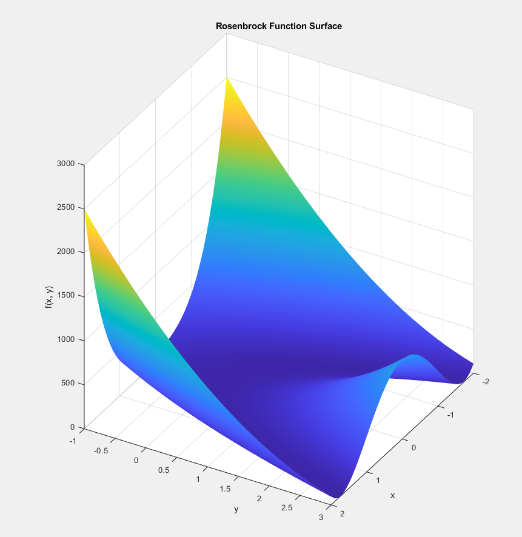

# Nonlinear Optimization: Quasi-Newton Method with BFGS Update and Backtracking Line Search

## Overview

This repository contains the implementation and performance analysis of the Quasi-Newton method with BFGS Hessian update combined with a backtracking line search technique for nonlinear optimization problems. The method aims to find efficient and robust solutions without requiring explicit Hessian calculations.

## Project Details

- Implements the Quasi-Newton algorithm with the BFGS update formula to approximate the Hessian matrix.
- Utilizes backtracking line search to dynamically adjust step sizes, employing the Armijo condition for convergence.
- Evaluates algorithm performance on classic optimization problems, including the Rosenbrock function.
- Analyzes efficiency based on execution time and iteration counts to convergence.
- Discusses practical considerations such as stopping criteria and parameter tuning.

## Project Structure

- **myfunctions.m**  
  Auxiliary MATLAB functions used by the main optimization script.

- **NonlinearOptimization.m**  
  Main MATLAB script implementing the Quasi-Newton method with BFGS update and backtracking line search, as well as performance analysis.

- **NonlinearOptimization.pdf**  
  Full project report with methodology, experiments, and results.

  ## Rosenbrock Function Visualization

The following image illustrates the Rosenbrock function, which is widely used as a benchmark in optimization problems. It helps to visualize the curvature and challenges of the optimization landscape tackled by the implemented methods.

## How to Use

1. Open the MATLAB environment.
2. Run the main script to execute the Quasi-Newton optimizer on desired functions.
3. Review generated plots and reports for analysis.

## Requirements

- MATLAB 
- Standard optimization toolboxes (optional)
- Basic plotting libraries included in MATLAB

## Author

David Matos Furtado  
2024

---
